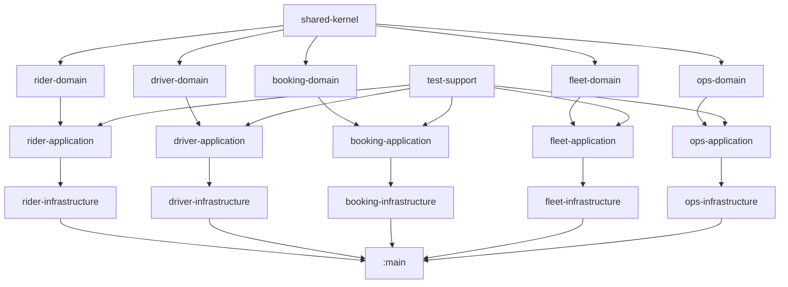

# Architecture

## Module Dependencies

```mermaid
graph TD

    SK[shared-kernel]

    %% Rider
    SK --> RD[rider-domain]
    RD --> RA[rider-application]
    RA --> RI[rider-infrastructure]

    %% Driver
    SK --> DD[driver-domain]
    DD --> DA[driver-application]
    DA --> DI[driver-infrastructure]

    %% Booking
    SK --> BD[booking-domain]
    BD --> BA[booking-application]
    BA --> BI[booking-infrastructure]

    %% Fleet
    SK --> FD[fleet-domain]
    FD --> FA[fleet-application]
    FA --> FI[fleet-infrastructure]

    %% Ops
    SK --> OD[ops-domain]
    OD --> OA[ops-application]
    OA --> OI[ops-infrastructure]

    %% Main
    RI --> MAIN[:main]
    DI --> MAIN
    BI --> MAIN
    FI --> MAIN
    OI --> MAIN

    %% Test Support
    TS[test-support] --> RA
    TS --> DA
    TS --> BA
    TS --> FA
    TS --> OA

```
For Main

For the test support
